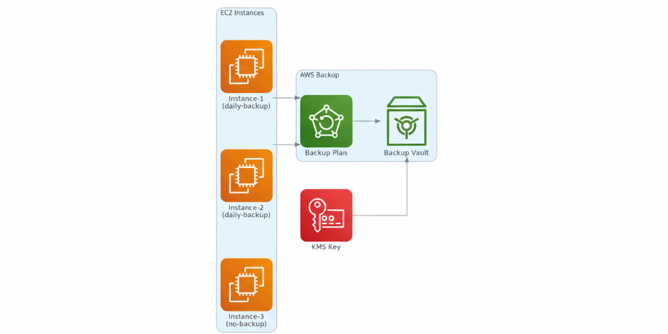

# 🔄 AWS Backup Solution for EC2

> **Enterprise-grade EC2 backups using AWS Backup service and Terraform**

[](https://terraform.io)
[](https://aws.amazon.com)

This project leverages AWS Backup service to create a fully-managed, enterprise-grade backup solution for EC2 instances with automated scheduling, retention policies, and encryption — **zero custom code required**.

## ✨ Features

- 🌙 **Automated daily backups** of EC2 instances tagged `BackupPlan=daily-backup`
- 🗓️ **Configurable retention policy** with automatic cleanup
- 🔐 **KMS encryption** for backup data at rest
- 🏛️ **AWS Backup service** - fully managed, no custom code
- 📊 **Built-in monitoring** and reporting via AWS Backup console
- 🧩 **Modular Terraform** structure for easy extension
- 🔒 **Service-linked IAM roles** with AWS managed policies

## 🏗️ Architecture


The backup solution uses AWS Backup service for a fully managed approach:

| Component | Purpose |
|-----------|---------|
| **AWS Backup Plan** | Defines backup schedule and retention rules |
| **AWS Backup Vault** | Secure storage for backup recovery points |
| **KMS Key** | Encrypts backup data at rest |
| **IAM Service Role** | Allows AWS Backup to access EC2 resources |
| **EC2 Instances** | Only instances tagged `BackupPlan=daily-backup` are backed up |

## 🚀 Quick Start

### Prerequisites

- AWS CLI configured with appropriate permissions
- Terraform >= 1.0

### 1️⃣ Clone & Setup

```bash
git clone <repository-url>
cd aws-backup-solution
```

### 2️⃣ Configure Variables

Create `terraform.tfvars`:

```hcl
region       = "us-east-1"
environment  = "production"
project_name = "ec2-backup"
```

### 3️⃣ Deploy Infrastructure

```bash
terraform init
terraform plan
terraform apply
```

**What gets created:**
- ✅ AWS Backup Plan with daily schedule
- ✅ AWS Backup Vault with KMS encryption
- ✅ IAM Service Role with AWS managed policies
- ✅ KMS Key for backup encryption
- ✅ Backup Selection targeting tagged resources
- ✅ Example EC2 instances with backup tags

## 📋 Usage

### Tag EC2 Instances for Backup

Simply tag any EC2 instance you want to backup:

```
Key: BackupPlan
Value: daily-backup
```

### Backup Process

1. **Scheduled Trigger**: AWS Backup executes based on the cron schedule (default: 2 AM UTC)
2. **Resource Discovery**: AWS Backup finds all resources tagged `BackupPlan=daily-backup`
3. **Backup Creation**: Creates encrypted backups in the backup vault
4. **Lifecycle Management**: Automatically deletes backups after retention period
5. **Monitoring**: Built-in AWS Backup monitoring and notifications

### Monitor Backups

- **AWS Backup Console**: View backup jobs, recovery points, and metrics
- **CloudWatch**: AWS Backup service metrics and alarms
- **AWS Config**: Compliance monitoring for backup policies

## 🛠️ Configuration
### Terraform Variables

| Variable | Type | Default | Description |
|----------|------|---------|-------------|
| `aws_region` | string | `us-west-2` | AWS region |
| `environment` | string | `dev` | Environment name |
| `backup_schedule` | string | `cron(0 2 * * ? *)` | EventBridge cron expression |
| `retention_days` | number | `7` | Snapshot retention period |

## 📦 Terraform Resources

This project uses native AWS Terraform resources:

- **aws_backup_plan** - Defines backup schedule and lifecycle rules
- **aws_backup_vault** - Secure storage for backup recovery points
- **aws_backup_selection** - Specifies which resources to backup
- **aws_kms_key** - Encryption key for backup data
- **aws_iam_role** - Service role for AWS Backup
- **[terraform-aws-modules/ec2-instance/aws](https://registry.terraform.io/modules/terraform-aws-modules/ec2-instance/aws)** - Example EC2 instances

## 🔧 Troubleshooting

### Common Issues

**Backups not running?**
- Check AWS Backup console for job status
- Verify backup plan is active
- Ensure resources have correct tags (`BackupPlan=daily-backup`)

**Backup jobs failing?**
- Review AWS Backup job details in console
- Check IAM service role permissions
- Verify KMS key permissions for encryption

**Resources not being backed up?**
- Ensure correct tag key/value (`BackupPlan=daily-backup`)
- Check backup selection configuration
- Verify resources are in the same region as backup plan

### Monitor Backup Status

Check backup status via AWS CLI:

```bash
aws backup list-backup-jobs --by-backup-vault-name <vault-name>
```

## 🧹 Cleanup

Remove all resources:

```bash
terraform destroy
```

**⚠️ Warning**: This will delete the backup vault and all recovery points stored within it.

## 🚀 Future Improvements
- Add SNS notifications for backup job failures
- Implement cross-region backup replication
- Add support for multiple backup plans (hourly, weekly, monthly)
- Integrate with AWS Organizations for centralized backup management

## 🤝 Contributing

1. Fork the repository
2. Create a feature branch
3. Make your changes
4. Add tests
5. Submit a pull request

## 📄 License

This project is licensed under the MIT License - see the [LICENSE](LICENSE) file for details.

## 🆘 Support
- 🐛 **Issues**: Report bugs via GitHub Issues
- 💡 **Feature Requests**: Suggest new features
- 💬 **Discussions**: Lets connect on [Linkedin](https://www.linkedin.com/in/hasan-ashab/)


---

**Made with ❤️ and ☕ by Hasan Ashab**
